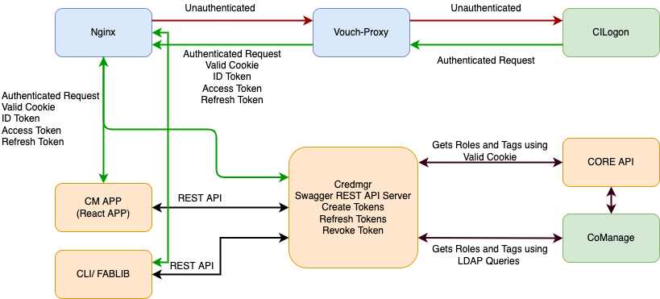

# CredentialManager

 ## Table of Contents

 - [Overview](#overview)
 - [Requirements](#requirements)
 - [API Specification](#apispec)
   - [API Version](#apiversion)
   - [API Tokens](#apitoken)
 - [Swagger Server](#swagger)
   - [Generate a new Server Stub](#generate)   
 - [Usage](#usage)
   - [Configuration](#config)
   - [Deployment](#deploy)
 - [Logging](#logging)
   - [Filebeat Configuration](#filebeat)
   - [Logstash Filters](#logstash)
   - [Metrics](#metrics)
     - [Sample Output](#samples)
   - [API Examples](#examples)
     - [Create tokens with default project and scope](#create1)
     - [Create tokens with project and scope](#create2)
     - [Refresh tokens](#refresh)
     - [Revoke tokens](#revoke)
   - [Identity Token Examples](#identity)
     - [Decode Id Token with default project and scope](#identity1)
     - [Decode Id Token with project and scope](#identity2)
   
## <a name="overview"></a>Overview
Fabric uses CILogon 2.0 and COmanage for Identity Authentication and Authorization management. 
Fabric Credential Manager provides generate and refreshes credentials for Fabric users. 
This package includes:
 - Swagger generated REST Server which supports APIs to create/refresh/revoke tokens
 - Uses Vouch-Proxy (with Nginx) to enable authentication using CILogon
 
 Credential Manager can roles directly from CoManage via ldap queries or via project registry. This is a configurable option. For now, by default it is configured to use LDAP queries.
 
 

## <a name="requirements"></a>Requirements
- Python 3.6+

## <a name="apispec"></a>API
API Documentation can be found [here](https://app.swaggerhub.com/apis-docs/kthare10/credmgr/1.0.1)

### <a name="apiversion"></a>Version

The Credmgr API is versioned based on the release found in GitHub.

API `version`:

Resource | Action | Input | Output
:--------|:----:|:---:|:---:
`/version` | GET: current API version | NA | Version format

Example: Version format

```json
{
  "gitsha1": "Release SHA as string",
  "version": "Release version as string"
}
```
### <a name="apitokens"></a>Tokens
Fabric tokens can be created, refreshed or revoked by following APIs. These tokens are used as an entry gate to CF APIs.
Tokens contain information to make policy decisions by various components against PDP to authorize a user.

API `/tokens`:
 
Resource | Action | Input | Output
:--------|:----:|:---:|:---:
`/create` | POST: create tokens for an user | `projectName` query parameter, `scope` query parameter | Token Format
`/refresh` | POST: refresh tokens for an user | `projectName` query parameter, `scope` query parameter, `refresh_token` body | Token Format
`/revoke` | POST: revoke token for an user | `refresh_token` body | 

Example: Token format
```json
{
  "id_token": "id_token",
  "refresh_token": "refresh_token"
}
```

## <a name="swagger"></a>Swagger Server
The swagger server was generated by the [swagger-codegen](https://github.com/swagger-api/swagger-codegen) project. By using the
[OpenAPI-Spec](https://github.com/swagger-api/swagger-core/wiki) from a remote server, you can easily generate a server stub.  

Credmgr uses the [Connexion](https://github.com/zalando/connexion) library on top of Flask.


### <a name="generate"></a>Generate a new server stub
In a browser, go to [Swagger definition](https://app.swaggerhub.com/apis/kthare10/credmgr/1.0.1)

From the generate code icon (downward facing arrow), select Download API > JSON Resolved

A file named kthare10-credmgr-1.0.1-resolved.json should be downloaded. Rename it as openapi.json and copy it to CredentialManager/fabric/credmgr. Run the following command to generate the Flask based server.

```bash
$ cp kthare10-credmgr-1.0.1-resolved.json openapi.json
$ ./update_swagger_stub.sh
```
Remove existing swagger_server directory and move my_server/swagger_server to swagger_server after verifying all changes are as expected.

## <a name="usage"></a>Usage
### <a name="config"></a>Configuration
#### Nginx Config
No change is needed for development deployment, for production, replace `$host` with host domain name.
```
 server {
     listen 443 ssl http2;
     server_name $host;

     #ssl_password_file /etc/keys/fifo;
     ssl_certificate /etc/ssl/public.pem;
     ssl_certificate_key /etc/ssl/private.pem;
```
#### CILogon Client Registration
- To get started, register your client at https://cilogon.org/oauth2/register and wait for notice of approval. Please register your callback URLs on that page with care. They are the only callback URLs that may be used by your client unless you later contact help@cilogon.org and request a change to your registration.
- Upon completion the user will be issued a `CILOGON_CLIENT_ID` and `CILOGON_CLIENT_SECRET`.
NOTE: Callback url should match the url specified in Vouch Proxy Config
#### Vouch Config
Copy the `vouch/config_template` as `vouch/config`.
Adjust the settings to suit your deployment environment
    - `jwt.secret:` - must be changed - if using in production, it likely needs to be the same as on all other services, e.g. Project Registry
    - `cookie.domain:` - your domain (default `127.0.0.1`)
    - `cookie.name:` - your cookie name (default `fabric-service`)
    - `oauth.client_id:` - CILogon Client ID (default `CILOGON_CLIENT_ID`)
    - `oauth.client_secret:` - CILogon Client Secret (default `CILOGON_CLIENT_SECRET`)
    - `oauth.callback_url:` - OIDC callback URL (default `http://127.0.0.1:9090/auth`)
```
    jwt:
        # secret - VOUCH_JWT_SECRET
        # a random string used to cryptographically sign the jwt
        # Vouch Proxy complains if the string is less than 44 characters (256 bits as 32 base64 bytes)
        # if the secret is not set here then Vouch Proxy will..
        # - look for the secret in `./config/secret`
        # - if `./config/secret` doesn't exist then randomly generate a secret and store it there
        # in order to run multiple instances of vouch on multiple servers (perhaps purely for validating the jwt),
        # you'll want them all to have the same secret
        secret: kmDDgMLGThapDV1QnhWPJd0oARzjLa5Zy3bQ8WfOIYk=

    cookie:
        # allow the jwt/cookie to be set into http://yourdomain.com (defaults to true, requiring https://yourdomain.com)
        secure: false
        # vouch.cookie.domain must be set when enabling allowAllUsers
        domain: 127.0.0.1
        name: fabric-service
oauth:
    # Generic OpenID Connect
    # including okta
    provider: oidc
    client_id: CILOGON_CLIENT_ID
    client_secret: CILOGON_CLIENT_SECRET
    auth_url: https://cilogon.org/authorize
    token_url: https://cilogon.org/oauth2/token
    user_info_url: https://cilogon.org/oauth2/userinfo
    scopes:
        - openid
        - email
        - profile
    callback_url: http://127.0.0.1:9090/auth
```

#### Credmr Config
Copy `config` file as `config_template`.
Adjust the settings to suit your deployment environment
```
oauth-client-id = 
oauth-client-secret = 

ldap-host = 
ldap-user = 
ldap-password = 
ldap-search-base =

project-registry-cert = /etc/credmgr/public.pem
project-registry-key =  /etc/credmgr/private.pem
project-registry-pass-phrase =

enable-project-registry = False
# Life time of the Fabric Identity Token specified in minutes
token-lifetime = 60
```
### <a name="deploy"></a>Deployment

Once the config file has been updated, bring up the containers. By default, self-signed certificates kept in ssl directory are used and refered in docker-compose.yml. For production, signed certificates must be used. 

```bash
 # bring using via docker-compose
 docker-compose up -d
 ```

## <a name="logging"></a>Logging
Credential Manager logs can be sent to ELK using filebeat and logstash either directly or via Kafka.

### <a name="filebeat"></a>Filebeat Configuration
Filebeat inputs should be configured as follows for Credential Manager. Path should be updated as per the location on the system running Credential Manager.
```
filebeat.inputs:

# Each - is an input. Most options can be set at the input level, so
# you can use different inputs for various configurations.
# Below are the input specific configurations.

- type: log

  # Change to true to enable this input configuration.
  enabled: true

  # Paths that should be crawled and fetched. Glob based paths.
  paths:
    - /opt/CredentialManager/log/credmgr/*.log
```

Filebeat output for logstash
```
output.logstash:
  # The Logstash hosts
  hosts: ["logstash:5044"]

  username: "<username>"
  password: "<password>"

  ssl.certificate_authorities: ["/etc/pki/root/ca.crt"]
```

Filebeat output for kafka
```
output.kafka:
  hosts: ["kafka:9092"]
  topic: "credmgr"
  codec.json:
    pretty: false
```

### <a name="logstash"></a>Logstash Filters
Credential Manager requires following filters to be configured in logstash.
```
filter {
  grok {
        pattern_definitions => { "GREEDYMULTILINE" => "(.|\n)*"
                                 "SYSTIME" => "%{SYSLOGTIMESTAMP}%{SPACE}%{YEAR}" }
        match => {
          "message" => [
                          "%{TIMESTAMP_ISO8601:credmgr_log_timestamp}%{SPACE}-%{SPACE}%{NOTSPACE:credmgr_component}%{SPACE}-%{SPACE}%{NOTSPACE:credmgr_location}%{SPACE}-%{SPACE}%{NOTSPACE:credmgr_log_level}%{SPACE}-%{SPACE}%{GREEDYMULTILINE:credmgr_log_message}",
                       ]
        }
      }
  }
```
Logstash input:
```
  beats {
    port => 5000
  }
   kafka {
            bootstrap_servers => "kafka:9092"
            topics => ["credmgr"]
            codec => json
    }
```

## <a name="metrics"></a>Metrics
Credential Manager is integrated to following metrics collected by Prometheus. User can view the metrics by 'http://localhost:8100/' once the container is running.
- Requests_Received : HTTP Requests received
- Requests_Success : HTTP Requests processed successfully
- Requests_Failed : HTTP Requests failed

### <a name="samples"></a>Sample output
```
# HELP Requests_Received_total HTTP Requests
# TYPE Requests_Received_total counter
Requests_Received_total{endpoint="/tokens/create",method="post"} 1.0
Requests_Received_total{endpoint="/tokens/{userID}",method="get"} 1.0
Requests_Received_total{endpoint="/tokens/refresh",method="post"} 1.0
Requests_Received_total{endpoint="/tokens/revoke",method="post"} 1.0
# TYPE Requests_Received_created gauge
Requests_Received_created{endpoint="/tokens/create",method="post"} 1.5893885201837184e+09
Requests_Received_created{endpoint="/tokens/{userID}",method="get"} 1.5893885393205898e+09
Requests_Received_created{endpoint="/tokens/refresh",method="post"} 1.589388545705302e+09
Requests_Received_created{endpoint="/tokens/revoke",method="post"} 1.589388551077782e+09
# HELP Requests_Success_total HTTP Success
# TYPE Requests_Success_total counter
Requests_Success_total{endpoint="/tokens/create",method="post"} 1.0
# TYPE Requests_Success_created gauge
Requests_Success_created{endpoint="/tokens/create",method="post"} 1.589388520186303e+09
# HELP Requests_Failed_total HTTP Failures
# TYPE Requests_Failed_total counter
Requests_Failed_total{endpoint="/tokens/{userID}",method="get"} 1.0
Requests_Failed_total{endpoint="/tokens/refresh",method="post"} 1.0
Requests_Failed_total{endpoint="/tokens/revoke",method="post"} 1.0
# TYPE Requests_Failed_created gauge
Requests_Failed_created{endpoint="/tokens/{userID}",method="get"} 1.5893885393271635e+09
Requests_Failed_created{endpoint="/tokens/refresh",method="post"} 1.5893885458823338e+09
Requests_Failed_created{endpoint="/tokens/revoke",method="post"} 1.58938855169857e+09
```

## <a name="examples"></a>API Examples

### <a name="create1"></a>Create a tokens with projectName=all and scope=all
NOTE: In this case, it is not required to pass projectName and scope in query parameters as they default to all.
```bash
curl -X POST -i "localhost:7000/tokens/create?projectName=all&scope=all" -H "accept: application/json"
HTTP/1.0 200 OK
Content-Type: application/json
Content-Length: 340
Server: Werkzeug/1.0.0 Python/3.6.8
Date: Thu, 19 Mar 2020 02:01:25 GMT

{
    "id_token": "eyJ0eXAiOiJKV1QiLCJraWQiOiIyNDRCMjM1RjZCMjhFMzQxMDhEMTAxRUFDNzM2MkM0RSIsImFsZyI6IlJTMjU2In0.eyJpc3MiOiJodHRwczovL2NpbG9nb24ub3JnIiwic3ViIjoiaHR0cDovL2NpbG9nb24ub3JnL3NlcnZlckEvdXNlcnMvMTE5MDQxMDEiLCJhdWQiOiJjaWxvZ29uOi9jbGllbnRfaWQvNzdlMWFlYTAyMGE0Njc2OTM3ZWFhMjJkZjFkNDMyZDgiLCJhdXRoX3RpbWUiOiIxNTg0MzgzMzg3IiwiZXhwIjoxNTg0Mzg0Mjg3LCJpYXQiOjE1ODQzODMzODcsImVtYWlsIjoia3RoYXJlMTBAZW1haWwudW5jLmVkdSIsImdpdmVuX25hbWUiOiJLb21hbCIsImZhbWlseV9uYW1lIjoiVGhhcmVqYSIsImNlcnRfc3ViamVjdF9kbiI6Ii9EQz1vcmcvREM9Y2lsb2dvbi9DPVVTL089VW5pdmVyc2l0eSBvZiBOb3J0aCBDYXJvbGluYSBhdCBDaGFwZWwgSGlsbC9DTj1Lb21hbCBUaGFyZWphIEExMTkwNDEwNiIsImlkcCI6InVybjptYWNlOmluY29tbW9uOnVuYy5lZHUiLCJpZHBfbmFtZSI6IlVuaXZlcnNpdHkgb2YgTm9ydGggQ2Fyb2xpbmEgYXQgQ2hhcGVsIEhpbGwiLCJlcHBuIjoia3RoYXJlMTBAdW5jLmVkdSIsImFmZmlsaWF0aW9uIjoiZW1wbG95ZWVAdW5jLmVkdTtzdGFmZkB1bmMuZWR1O21lbWJlckB1bmMuZWR1IiwibmFtZSI6IktvbWFsIFRoYXJlamEiLCJhY3IiOiJ1cm46b2FzaXM6bmFtZXM6dGM6U0FNTDoyLjA6YWM6Y2xhc3NlczpQYXNzd29yZFByb3RlY3RlZFRyYW5zcG9ydCIsImVudGl0bGVtZW50IjoidXJuOm1hY2U6ZGlyOmVudGl0bGVtZW50OmNvbW1vbi1saWItdGVybXMifQ.d18gtV85V0ik4jfKyalguSgnmlszz--cNrQ4fWY2c29POQf1LgaMKpDlLrR_eQ1sz1TOMMtrqhgJ764CsJIVTqVtWEqL7vQsPFffRcO5rT80OdeOyKH5jQirbWEgGomEOzZg1GCtW9KFh88aVQtV6nnxhGD0Lua7tUJMzAfMm7_2exTw3EehqOt0thPVzKsOPlGCQ_iuc3FRDI2vMNbzpTsSXfgqpTAwwD9DXcSf9QfmuvwFaKIjOQAywR-HJBZ1TwFAZVIAeGzyR-2XuofX8TaAWZDfDyppe8q8-bf-_3-XhjBHtMJ8Z87SaiIfHyDdk4sG7SJoxx7Ry3DS5VPO6Q",
    "refresh_token": "https://cilogon.org/oauth2/refreshToken/46438248f4b7691a851f88b0849d9687/1584383387474"
}
```
### <a name="create2"></a>Create Token for projectName=RENCI-TEST and scope=measurement
```
curl -X POST -i "localhost:7000/tokens/create?projectName=RENCI-TEST&scope=measurement" -H "accept: application/json"
HTTP/1.0 200 OK
Content-Type: application/json
Content-Length: 340
Server: Werkzeug/1.0.0 Python/3.6.8
Date: Thu, 19 Mar 2020 02:06:43 GMT

{
    "id_token": "eyJ0eXAiOiJKV1QiLCJraWQiOiIyNDRCMjM1RjZCMjhFMzQxMDhEMTAxRUFDNzM2MkM0RSIsImFsZyI6IlJTMjU2In0.eyJpc3MiOiJodHRwczovL2NpbG9nb24ub3JnIiwic3ViIjoiaHR0cDovL2NpbG9nb24ub3JnL3NlcnZlckEvdXNlcnMvMTE5MDQxMDEiLCJhdWQiOiJjaWxvZ29uOi9jbGllbnRfaWQvNzdlMWFlYTAyMGE0Njc2OTM3ZWFhMjJkZjFkNDMyZDgiLCJhdXRoX3RpbWUiOiIxNTg0MzgzMzg3IiwiZXhwIjoxNTg0Mzg0Mjg3LCJpYXQiOjE1ODQzODMzODcsImVtYWlsIjoia3RoYXJlMTBAZW1haWwudW5jLmVkdSIsImdpdmVuX25hbWUiOiJLb21hbCIsImZhbWlseV9uYW1lIjoiVGhhcmVqYSIsImNlcnRfc3ViamVjdF9kbiI6Ii9EQz1vcmcvREM9Y2lsb2dvbi9DPVVTL089VW5pdmVyc2l0eSBvZiBOb3J0aCBDYXJvbGluYSBhdCBDaGFwZWwgSGlsbC9DTj1Lb21hbCBUaGFyZWphIEExMTkwNDEwNiIsImlkcCI6InVybjptYWNlOmluY29tbW9uOnVuYy5lZHUiLCJpZHBfbmFtZSI6IlVuaXZlcnNpdHkgb2YgTm9ydGggQ2Fyb2xpbmEgYXQgQ2hhcGVsIEhpbGwiLCJlcHBuIjoia3RoYXJlMTBAdW5jLmVkdSIsImFmZmlsaWF0aW9uIjoiZW1wbG95ZWVAdW5jLmVkdTtzdGFmZkB1bmMuZWR1O21lbWJlckB1bmMuZWR1IiwibmFtZSI6IktvbWFsIFRoYXJlamEiLCJhY3IiOiJ1cm46b2FzaXM6bmFtZXM6dGM6U0FNTDoyLjA6YWM6Y2xhc3NlczpQYXNzd29yZFByb3RlY3RlZFRyYW5zcG9ydCIsImVudGl0bGVtZW50IjoidXJuOm1hY2U6ZGlyOmVudGl0bGVtZW50OmNvbW1vbi1saWItdGVybXMifQ.d18gtV85V0ik4jfKyalguSgnmlszz--cNrQ4fWY2c29POQf1LgaMKpDlLrR_eQ1sz1TOMMtrqhgJ764CsJIVTqVtWEqL7vQsPFffRcO5rT80OdeOyKH5jQirbWEgGomEOzZg1GCtW9KFh88aVQtV6nnxhGD0Lua7tUJMzAfMm7_2exTw3EehqOt0thPVzKsOPlGCQ_iuc3FRDI2vMNbzpTsSXfgqpTAwwD9DXcSf9QfmuvwFaKIjOQAywR-HJBZ1TwFAZVIAeGzyR-2XuofX8TaAWZDfDyppe8q8-bf-_3-XhjBHtMJ8Z87SaiIfHyDdk4sG7SJoxx7Ry3DS5VPO6Q",
    "refresh_token": "https://cilogon.org/oauth2/refreshToken/46438248f4b7691a851f88b0849d9687/1584383387474"
}
```

### <a name="refresh"></a>Refresh token with projectName=all and scope=all
```bash
curl -X POST -i "localhost:7000/tokens/refresh?projectName=all&scope=all" -H "accept: application/json" -H "Content-Type: application/json" -d '{"refresh_token": "https://cilogon.org/oauth2/refreshToken/46438248f4b7691a851f88b0849d9687/1584383387474"}'
HTTP/1.0 200 OK
Content-Type: application/json
Content-Length: 1624
Server: Werkzeug/1.0.0 Python/3.6.8
Date: Mon, 16 Mar 2020 18:32:06 GMT

{
    "id_token": "eyJ0eXAiOiJKV1QiLCJraWQiOiIyNDRCMjM1RjZCMjhFMzQxMDhEMTAxRUFDNzM2MkM0RSIsImFsZyI6IlJTMjU2In0.eyJpc3MiOiJodHRwczovL2NpbG9nb24ub3JnIiwic3ViIjoiaHR0cDovL2NpbG9nb24ub3JnL3NlcnZlckEvdXNlcnMvMTE5MDQxMDEiLCJhdWQiOiJjaWxvZ29uOi9jbGllbnRfaWQvNzdlMWFlYTAyMGE0Njc2OTM3ZWFhMjJkZjFkNDMyZDgiLCJhdXRoX3RpbWUiOiIxNTg0MzgzMzg3IiwiZXhwIjoxNTg0Mzg0NDI2LCJpYXQiOjE1ODQzODM1MjYsImVtYWlsIjoia3RoYXJlMTBAZW1haWwudW5jLmVkdSIsImdpdmVuX25hbWUiOiJLb21hbCIsImZhbWlseV9uYW1lIjoiVGhhcmVqYSIsImNlcnRfc3ViamVjdF9kbiI6Ii9EQz1vcmcvREM9Y2lsb2dvbi9DPVVTL089VW5pdmVyc2l0eSBvZiBOb3J0aCBDYXJvbGluYSBhdCBDaGFwZWwgSGlsbC9DTj1Lb21hbCBUaGFyZWphIEExMTkwNDEwNiIsImlkcCI6InVybjptYWNlOmluY29tbW9uOnVuYy5lZHUiLCJpZHBfbmFtZSI6IlVuaXZlcnNpdHkgb2YgTm9ydGggQ2Fyb2xpbmEgYXQgQ2hhcGVsIEhpbGwiLCJlcHBuIjoia3RoYXJlMTBAdW5jLmVkdSIsImFmZmlsaWF0aW9uIjoiZW1wbG95ZWVAdW5jLmVkdTtzdGFmZkB1bmMuZWR1O21lbWJlckB1bmMuZWR1IiwibmFtZSI6IktvbWFsIFRoYXJlamEiLCJhY3IiOiJ1cm46b2FzaXM6bmFtZXM6dGM6U0FNTDoyLjA6YWM6Y2xhc3NlczpQYXNzd29yZFByb3RlY3RlZFRyYW5zcG9ydCIsImVudGl0bGVtZW50IjoidXJuOm1hY2U6ZGlyOmVudGl0bGVtZW50OmNvbW1vbi1saWItdGVybXMifQ.c5yAC1TanrIBF3h4NISk8hRSzSPu0uvetzv8JoZ65o3BE3TH6U85ZszLA1PUjTB6X55OzkxyqabgUw6kcPRGfLwbdWqVmYDmGDB1E2Y9Qxnhv_4Colan8po0bwA86Oc2Npbjmxr5njXuR_FdIq5NfGVOP8sov5z7kYSHHp4Pur9CtyyLc9eHIIqAfMOoNwRzRqGxT9dZ-LioHpVnyFDM_Zcxf3nZe3iz2WV7NFzVhL7xTLe8VxEP3WC41_p4D_r4B0zEBEAYYhXGCS0JtiZyO9XdJaSBvktMdRwaNPg41O8nAQvzjjh4j686JHVW93Wwt4tdjGq0KTcDCRqeN4puZw",
    "refresh_token": "https://cilogon.org/oauth2/refreshToken/6d13c5ac6205087ae7ab869e68f729b4/1584383526222"
}
```

### <a name="revoke"></a>Revoke token 
```bash
curl -X POST -i "localhost:7000/tokens/revoke" -H "accept: application/json" -H "Content-Type: application/json" -d '{"refresh_token": "https://cilogon.org/oauth2/refreshToken/46438248f4b7691a851f88b0849d9687/1584383387474"}'
HTTP/1.0 200 OK
Content-Type: application/json
Content-Length: 106
Server: Werkzeug/1.0.0 Python/3.6.8
Date: Mon, 16 Mar 2020 18:32:38 GMT

```
## <a name="identity"></a>Identity Token examples
### <a name="identity1"></a>Decoded Id Token Returned for projectName=all and scope=all
```
{
  "iss": "https://cilogon.org",
  "sub": "http://cilogon.org/serverA/users/11904101",
  "aud": "cilogon:/client_id/311cbebecefc7c1a6e0282e13fcf9588",
  "auth_time": "1584583311",
  "exp": 1584584211,
  "iat": 1584583311,
  "email": "kthare10@email.unc.edu",
  "given_name": "Komal",
  "family_name": "Thareja",
  "cert_subject_dn": "/DC=org/DC=cilogon/C=US/O=University of North Carolina at Chapel Hill/CN=Komal Thareja A11904106",
  "idp": "urn:mace:incommon:unc.edu",
  "idp_name": "University of North Carolina at Chapel Hill",
  "eppn": "kthare10@unc.edu",
  "affiliation": "employee@unc.edu;staff@unc.edu;member@unc.edu",
  "name": "Komal Thareja",
  "acr": "urn:oasis:names:tc:SAML:2.0:ac:classes:PasswordProtectedTransport",
  "entitlement": "urn:mace:dir:entitlement:common-lib-terms",
  "roles": [
    "CO:members:active",
    "CO:COU:Jupyterhub:members:active",
    "CO:COU:RENCI-TEST:members:active"
  ],
  "scope": "all",
  "project": "all"
}
```
### <a name="identity2"></a>Decoded Token for projectName=RENCI-TEST and scope=measurement
```
{
  "iss": "https://cilogon.org",
  "sub": "http://cilogon.org/serverA/users/11904101",
  "aud": "cilogon:/client_id/311cbebecefc7c1a6e0282e13fcf9588",
  "auth_time": "1584583311",
  "exp": 1584584554,
  "iat": 1584583654,
  "email": "kthare10@email.unc.edu",
  "given_name": "Komal",
  "family_name": "Thareja",
  "cert_subject_dn": "/DC=org/DC=cilogon/C=US/O=University of North Carolina at Chapel Hill/CN=Komal Thareja A11904106",
  "idp": "urn:mace:incommon:unc.edu",
  "idp_name": "University of North Carolina at Chapel Hill",
  "eppn": "kthare10@unc.edu",
  "affiliation": "employee@unc.edu;staff@unc.edu;member@unc.edu",
  "name": "Komal Thareja",
  "acr": "urn:oasis:names:tc:SAML:2.0:ac:classes:PasswordProtectedTransport",
  "entitlement": "urn:mace:dir:entitlement:common-lib-terms",
  "roles": [
    "CO:COU:RENCI-TEST:members:active"
  ],
  "scope": "measurement",
  "project": "RENCI-TEST"
}
```
