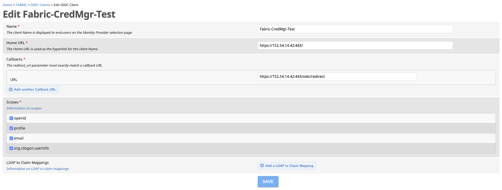
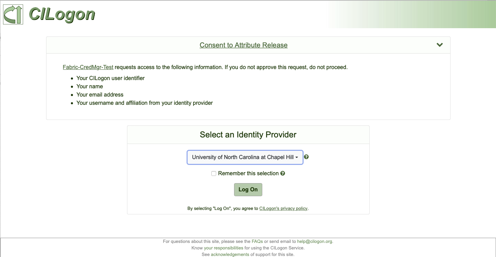
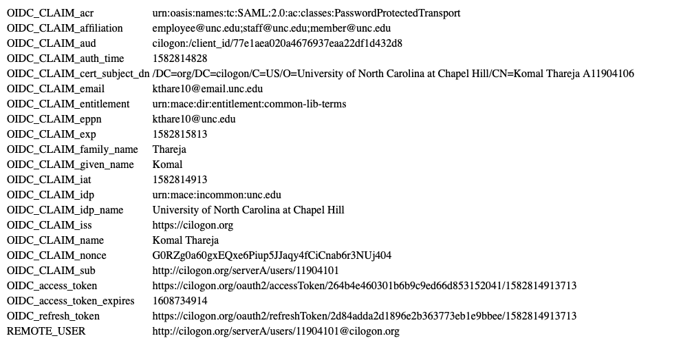

# CILogon Example using mod_auth_openidc
Valid credentials on the Fabric COmanage instance are required to create OIDC Clients. Screenshots are included for refernce purposes.

Offical documentation: http://www.cilogon.org/oidc

## Register OIDC client in COmanage
Create a test client:Fabric-CredMgr-Test
- Name: Fabric-CredMgr-Test
- Home URL: https://152.54.14.42:443/
- Error URL: https://152.54.14.42:443/error
- Callback URL: https://152.54.14.42:443/oidc/redirect
- Refresh Token Lifetime: 10 days
- Scopes:
  openid
  profile
  email
  org.cilogon.userinfo
  
NOTE: IP Address here should be replaced with fqdn of your test/production server.



NOTE: Currently GUI does not allow enabling refresh tokens, so snapshot needs to be refreshed once this feature is available. For now, refresh tokens were enabled by sending an email to help@cilogon.org containing the client Ids.

Once added, the Client ID and Client Secret are generated and displayed to the user. The Client Secret IS NOT stored on the CILogon server and must be preserved locally.

- Client Id: cilogon:/client_id/77e1aea020a4676937eaa22df1d432d8
- Client Secret: SPY0AxjgVbzFrXKnmqe_5ehQzt-rWZ_wPij-r8RXw-CPhHKFmr1AoNgjyWh7u1DSjt8G_SVooUzIyrCAhu6J_g

## Install packages
```
yum install httpd
yum install php php-common php-opcache php-mcrypt php-cli php-gd php-curl php-mysqlnd
wget http://mirror.centos.org/centos/7/os/x86_64/Packages/jansson-2.10-1.el7.x86_64.rpm
wget http://mirror.centos.org/centos/7/os/x86_64/Packages/jansson-devel-2.10-1.el7.x86_64.rpm
wget https://github.com/zmartzone/mod_auth_openidc/releases/download/v2.3.0/cjose-0.5.1-1.el7.centos.x86_64.rpm
wget http://download-ib01.fedoraproject.org/pub/epel/7/x86_64/Packages/h/hiredis-0.12.1-1.el7.x86_64.rpm
wget https://github.com/zmartzone/mod_auth_openidc/releases/download/v2.4.1/mod_auth_openidc-2.4.1-1.el7.x86_64.rpm
yum localinstall -y jansson jansson-devel cjose hiredis mod_auth_openidc
```

## Configure mod_auth_openidc on impact-cilogon.renci.org

In the configuration directory for your Apache HTTPD installation (on CentOS, this is /etc/httpd/conf.d/), create a new file openidc.conf with the following configuration. Enter your "client identifier" and "client secret" you got from the previous step. Also set a passphase of your choosing.
```
LoadModule auth_openidc_module /usr/lib64/httpd/modules/mod_auth_openidc.so
OIDCProviderMetadataURL  https://cilogon.org/.well-known/openid-configuration

OIDCClientID          "cilogon:/client_id/77e1aea020a4676937eaa22df1d432d8"
OIDCClientSecret      "SPY0AxjgVbzFrXKnmqe_5ehQzt-rWZ_wPij-r8RXw-CPhHKFmr1AoNgjyWh7u1DSjt8G_SVooUzIyrCAhu6J_g"

OIDCRedirectURI       https://152.54.14.42:443/oidc/redirect
OIDCScope             "openid email profile org.cilogon.userinfo"
OIDCCryptoPassphrase  "aiPheibohL4bietha7joo9ooJiefee3a"

<Location /oidc/>
  AuthType openid-connect
  Require valid-user
</Location>
```
You will need to reload the httpd service configuration after creating this file. On CentOS, this can be accomplished as root with service httpd reload.

## Enable Refresh Tokens
Edit auth_openidc.conf (on CentOS, this is /etc/httpd/conf.d/), to enable refresh tokens.
```
# Indicates whether the refresh token will be passed to the application in a header/environment variable, according
# to the OIDCPassClaimsAs directive.
# Can be configured on a per Directory/Location basis. The default is "Off".
OIDCPassRefreshToken On
```
You will need to reload the httpd service configuration after creating this file. On CentOS, this can be accomplished as root with service httpd reload.

## Set up the "oidc" directory
In the Apache HTTPD DocumentRoot directory (on CentOS, this is /var/www/html/), create new directorires "oidc" and "oidc/redirect" and a simple file to test your setup. Below is an example PHP script which prints out the HTTP header variables set by the mod_auth_openidc module.

```
mkdir -p /var/www/html/oidc/redirect
echo '<html><head><title>OIDC Variables</title></head><body>
<table>
<?php
ksort($_SERVER);
foreach ($_SERVER as $key => $value) {
    if ((preg_match("/^OIDC/",$key)) ||
        (preg_match("/^REMOTE_USER/",$key))) {
        echo "<tr><td>$key</td><td>$value</td></tr>\n";
    }
}
?>
</table>
</body></html>' > /var/www/html/oidc/index.php
```
## Test your setup

Open a web browser, go to https://152.54.14.42:443/oidc/index.php, select an identity provider, authenticate with your chosen identity provider, and view the results.



Here is example output using University of North Carolina at Chapel Hill as the Identity Provider:



## Handling Errors

In the default configuration, mod\_auth\_openidc simply prints out the error message and description thrown by OpenID Connect Providers. You can configure mod\_auth\_openidc to redirect to a different page where you can better handle OIDC errors. Add the following line to your openidc.conf file:

```
OIDCHTMLErrorTemplate /etc/httpd/conf.d/oidcErrorTemplate.html

```

This HTML file can reside anywhere, but must be readable by the Apache httpd process. Then create the HTML file as follows:

```
echo '<html><body onload="document.forms[0].submit()">
  <form method="post" action="http://www.example.org/error">
    <input name="error" value="%s">
    <input name="error_description" value="%s">
  </form>
</body></html>' > /etc/httpd/conf.d/oidcErrorTemplate.html
```
Change http://www.example.org/error to a valid location on your server which can handle the submitted form. Note that you will need to reload the httpd service configuration to pick up the new error template file.
